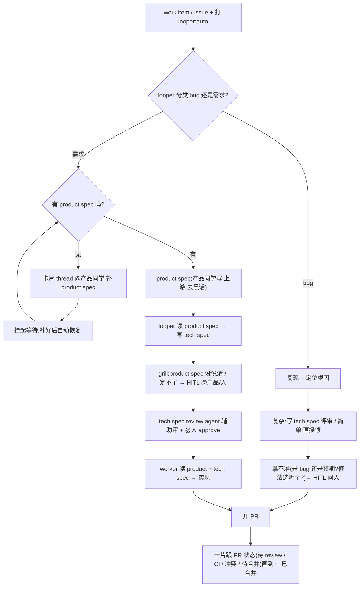

# PLAN — looper 自动化研发流程改造

> 状态:草案 · 待拍板。汇总真机试跑 + 群里试用暴露的问题、定下来的方向,以及一次 fresh-agent 对抗评审 + Plane Pages spike 后的修正。给团队 review 用。
> 背景:looper 每人本地跑一套,任务卡片发到同一个飞书群。

**先约定几个词**(下面反复出现):
- **HITL**:human-in-the-loop —— agent 拿不准时,发一张卡片到群里问人。
- **卡片**:looper 为每个任务在飞书群里发的那张卡(标题 + 进度);点开是一个 thread(折叠讨论)。
- **PR / CI / label**:GitHub 的拉取请求 / 持续集成检查 / 标签。
- **looper 的 4 个角色**:分别负责 **写方案(planner)、写代码(worker)、审 PR(reviewer)、修 PR(fixer)**。
- **spec-forge**:一个把需求写成方案、再让另一个 agent 逐轮「挑刺拷问」的工具(skill)。

## 1. 为什么要改

HITL 已经上线(v0.10.1)。用一个全新 agent 照文档从零配好、跑了个真任务、把卡片发进群之后,暴露出一批「看着含糊 / 不太对 / 不够稳」的问题。这份文档把它们和对应改法理清,作为分批实现的依据。

一句话目标:**卡片准确反映任务的真实状态;标签只表达「要做什么」、不随进度乱变;笔记本随时关也能自恢复;只有代码真正合并才算完成。**

## 1.5 目标流程图(北极星)

> 这是我们要 looper 最终跑通的**完整流程**。§3 只是把「已经在跑的那一小段」做对;§8 才是把整张图建起来。评审请对照这张图看 plan 有没有漏、有没有和图冲突。



**贯穿全程**:HITL 一直在(任何阶段 agent 定不了 → 发卡问人);只有「已合并」算完成;该由人做的活不打 `looper:auto`。

## 2. 试跑暴露的问题

| # | 现象 | 说明 |
|---|---|---|
| P1 | 同一个任务**发了 2–3 张卡** | 两个独立成因:(a) **单个环节内抢跑**——发卡是「查有没有→没有就发」的无锁竞态;(b) **跨环节**——写方案、写代码是两段,各发一张。 |
| P2 | 「处理中」卡片**露出原始命令行**(像 `tmpdir=$(mktemp …`) | 泄漏在卡片的**摘要行**:匹配不到已知阶段时,就原样吐出最近一条工具命令。**不是标题**。 |
| P3 | 「✅ 已完成」**其实没完成** | 这里的「完成」只是「开了 PR」,PR 还开着没合并;后面还有 review / QA / 解冲突 / CI / 合并一整条。 |
| P4 | 一个需求**冒出 2 个 PR** | 这个 bundle **配置配错了**(把「写代码」也配成「写方案」的标签),两个角色各开一个 PR。looper 默认两个标签本就不同;缺的是**没有校验拦跨角色标签重叠**。 |
| P5 | 任务做完后,**群里再追问它不理人** | 已完成的任务直接忽略后续消息。 |
| P6 | 启动方式是「挂后台跑」 | 一个裸后台进程,**重启 / 合盖 / 退出登录就没了,崩了也不会自己起来**。 |

## 3. 改造项(把现在已经在跑的部分做对)

### A. 卡片 = 任务 / PR 真实状态的实时镜像

**原则**:标题反映**真状态**,不用「处理中 / 已完成」这种含糊说法。**只有「已合并」是绿色终点。**

从 GitHub 读 PR 的真实状态,映射成精准标题:

| PR 实况 | 标题 |
|---|---|
| 草稿 | 📝 草稿 · PR #N |
| CI 跑测中 | 🔄 CI 检查中 · PR #N |
| CI 失败 | ❌ CI 失败 · PR #N |
| 有冲突 | ⚠️ 冲突待解 · PR #N |
| 待 review | 👀 待 review · PR #N |
| 被要求改 | ✋ 待修改 · PR #N |
| 已批准、可合并、CI 绿 | ✅ 待合并 · PR #N |
| **已合并** | 🎉 **已合并** · PR #N ← 唯一终点 |
| 关闭但没合并 | 🚫 已关闭 · PR #N |

**状态从哪来 —— agent 自己报 + GitHub 事件推送,不靠「等需求关闭」(太慢):**
- **在干活时:agent 自己报**。给 agent 一个更新卡片的命令,在提示词里写清期望它报告的状态(开了 PR 待 review / 解冲突中 / 已交付…),它边干边更新。
- **它没在跑的空档**(别人去 review、合并、CI 出结果)→ 靠 **GitHub 事件推送(webhook)实时接**,不去反复查。

> ⚠️ **这一项和 §B 的「任务身份」绑在一起**:事件推送要知道「更新哪张卡」,就得先有 §B 的「任务→卡片」映射。所以 A 不是小改,依赖 §B。

### B. 一个任务一张卡(领域改造,不是小 bug)

**事实**:一个需求可能对应多个 PR(方案一个、实现一个,甚至多个实现)。目标是一张卡汇总一个需求名下所有 PR。

⚠️ **这是领域模型改造**:looper 现在**没有跨环节的「任务」实体**——一次运行(loop)只认「项目」或「某个 PR」,写方案的运行和它下游写代码/审/修的运行**不共享任务 id**;卡片是**按每次运行存的**。要做到「一张卡汇总一个需求名下所有 PR」,得设计一个**任务身份 + 任务→PR→卡片映射**,**先设计后实现,别塞进小 PR**。

→ **不一定从零建 task 表**:planner / worker 的 metadata **本就都带 `issueNumber`**,可优先把卡片的 key 从「每次运行」换成「**源需求(work-item / issue)**」,多环节自然汇一卡。边界要兜底:PR 触发的运行、项目级运行、无 issue 的 bug 没有这个键。

- **一个任务 = 一张卡**;写方案、写代码、审、修,以及名下所有 PR,**全汇进这一张**。
- 卡片头是**任务整体进度**;正文逐条列每个 PR 的状态。
- **任务算完成 = 需求真的解决(名下 PR 都合并)**,不是某一个 PR 合了就算。

示例(多 PR):
```
🔧 进行中 · #1 · 2 个 PR
──────────────
· PR #2 方案  👀 待 review
· PR #3 实现  ✅ 待合并
```

### C. 标签只表达「要做什么」,打一次不变

**原则**:**标签在最前面打一次、表达意图**;进度推进是 looper 内部的事,**不靠改标签驱动、也不用人再打第二个**;进度让卡片去体现。

| 标签(全程不变) | 含义 |
|---|---|
| `looper:auto`(新) | 全自动:方案 → 实现,一路到底 |
| `looper:plan` | 只写方案 → 停下,等人评审(轻量,不走 spec-forge 时) |
| `looper:worker-ready` | 直接实现(已有现成方案 / 简单活) |

- **没有「档位」这回事**:实现时 HITL 一直在,agent 卡住就发卡问人 —— 不需要事先把任务分成「全自动 / 要盯着」两档。
- 该由人做的活,**就不打 looper 的标签**,直接给人。
- **P4 是 bundle 配置配错**(「写代码」被配成「写方案」的标签):looper 默认两个标签本就不同,但**没有校验拦跨角色标签重叠**。→ 修法是**加一条跨角色 trigger-label 重叠校验**,不是改代码默认值。

### D. 方案文档:产品写 product spec,looper 写 tech spec;评审都在 Plane,不进代码仓

> 团队定调(2026-07-06,陈哲 / 麻薯讨论):方案**长期不放代码仓库**;**评审整套做进 Plane**;方案以 **Plane 文档(Page)** 存在。**product spec(产品方案)由产品同学写(不是 looper);looper 跟进它写 tech spec(技术方案)、评审、实现。**

- **product spec = 产品同学写**(讲清 what / why,给人看、去黑话)。**looper 不写它。**
- **looper 从 product spec 写出 tech spec**:
  - 边写边让另一个 agent 挑刺拷问;**产品方案没说清、agent 自己定不了的点 → 整理成卡片问产品 / 人**(HITL 在写方案阶段就用上了)。
- **技术方案评审(agent 帮着审,不必纯人工)**:一个 agent 先审出漏洞 / 矛盾 / 风险、整理意见;要人拍板的 **@人 approve**;琐碎的可以让 agent 自己过。⚠️ **「@人 approve」是新状态机**:现在 reviewer 是**全自动自己 approve**,人审门要新建(见 §8.6)。
- **实现**:批准后,「写代码」读 产品方案 + 技术方案,直接实现。

**好处**:①分工清楚(**产品写 what,looper 写 how + 做**);②评审在 Plane、不落代码仓、不留悬着的方案 PR;③looper 自带的「写方案」角色、以及「把方案当仓库文件」那套,**迁移/重写**成 Plane 文档(不是简单删)。

**技术方案怎么读写 —— 已 spike 实测(§9)通过**:方案都是 **Plane 文档**。用 `plane` CLI 对真部署实测,`page create / get --content / update / list / delete` + work-item 评论**全通、内容正确 round-trip、改动也生效**。→ 走 **(a) agent 用 `plane` CLI**(推荐)。代价:**外部 CLI 依赖**(CLI 缺失 / 版本漂移 / key 过期要有降级:清晰报错、不丢任务)+ 每人一把 key。遗留:page 是**项目级**、不直接绑 work item,「哪份页是这个需求的产品方案」要定个**关联约定**(待定,见 8.2)。

**为什么两层分开、不把 spec-forge 塞进 looper**:挑刺拷问要靠一个独立的、没被「作者视角」污染的 agent + 真人;两层用 Plane 标签衔接就够。

**待定**:方案批准后,谁把 looper 的标签打上去(人手动 / 发布时预置 / 一个「批准即打标」的小自动化)。

> 简单活(不需要方案)不走这条:直接触发实现。

### E. 恢复能力(笔记本随时关也不丢活)

**已经有的(不用造)**:能装成**开机自启、崩了自动重启的常驻服务**(macOS 走 launchd);**进程启动时**会自动恢复 —— 把没跑完的活标出来、清掉残留进程、重新排队;而且是**从断点继续**(不从头来),甚至接着原来的 AI 会话跑。

**要改 / 要加固**:
1. **onboarding 改成装常驻服务**(现在是「挂后台」,重启就没)→ 合盖 / 重启后自动起来、自动续。**(P6,最关键的一改;低风险,先上)**
2. **睡眠 ≠ 关机(要「建」不是「测」)**:**完整**恢复(孤儿回收 / 锁释放 / reviewer 恢复 / requeue)只在**进程启动**跑一次;合盖是挂起、**不重启**,所以醒来后这些都不重跑。已经有一个「live stale-run reconcile」,但**只在调度器满载(可用槽=0)时触发,且不含锁 / 孤儿 / reviewer 恢复**。→ 要做的是**放宽它的触发**(定时 + 检测 wall-clock 跳变 > N 秒)**并扩大覆盖**到锁 / 孤儿 / requeue,**不是从零新造**。
3. **恢复不能重复干**:PR 侧部分已有(复用已存在 PR 而非重开);真正缺的是**卡片不重复** —— 和 §B 的「一个任务一张卡」同源,一起做。
4. **干到一半被杀**:本地改了一半时,重跑那一步要能干净接上 —— 验一下常见情况。

### F. 任务做完后再追问(P5)

PR 没合并前,卡片一直活,追问能接住(转给「修 PR」应答)。**合并之后**再追问,三选一(待定):
- **A** 自动重开 / 续跑(当成新一轮需求或答疑)
- **B** 至少回一句「本任务已完成,继续请在 issue/PR 上说、或新建任务」,别冷场
- **C** 保持不理(现状)

### G. 几个卡片 bug 修复

- **P1 双发 = 两个成因,拆开**:
  - (a) **单环节内抢跑**(「查有没有卡→没有就发」无锁竞态;进度 ticker 和发卡路径会并发同一环节)—— 修法**不只是加约束**:因为是「**先 HTTP 发卡、再写库**」,两个并发都会先把卡发出去(群里已两张),约束只在事后拦第二次写库。真正止血要**发卡前先占位**——对该环节的 `loop_id` 做事务性 INSERT-or-get 抢「赢家」(或进程内按 `loop_id` 加锁),赢家才发卡。比「加个约束」略重,但仍属小改。(注:这张映射表按 **`loop_id`** 存,不是 run。)
  - (b) **跨环节重复**(写方案卡 + 写代码卡各一张)—— 需要 §B 的任务身份,**大改**。
- **P2 露命令**:泄漏在**摘要行**(匹配不到已知阶段就吐最近一条工具命令),**不是标题**。修:匹配不到就显示友好措辞(如「🔧 实现中…」),原始命令只留在卡片里的讨论中。
- **P3 措辞**:被 A 的状态映射吸收(不再有含糊的「已完成」)。

## 4. 和 synclo AFK 的关系

`looper:auto` = **looper 自己的「全自主执行」入口**。有了它,synclo 那套 `afk:go` 自建执行器就能**退役**:AFK 只保留前面的「分诊 / 拆解 / 派活」,产出改成打 `looper:auto` + 指派,**执行整个交给 looper**。中间那座「把 Plane 任务转成 GitHub issue」的桥,也随 looper 能直接读 Plane 而退役。**注意:同一个任务别既打 `afk:go` 又打 `looper:auto`,否则两个执行器会抢着做。**

## 5. 分批实现(建议)

1. **PR-1 立即可上的小修**(低风险,已开 #521 起头):① onboarding 换 launchd 常驻服务(§E.1)② 单环节竞态修(§G P1a)③ 摘要行去露命令(§G P2)④ 跨角色标签重叠校验(§C)。**不含「关 planner」**——写方案是要迁移/重写成 Plane 文档,不是删。
2. **PR-2 任务身份 + 一个任务一张卡**(§B,**领域改造,先设计后实现**):新建「任务→PR→卡片」映射。PR-3 硬依赖它。
3. **PR-3 卡片 = PR 状态镜像**(§A):agent 自报命令 + 提示词状态词表 + 接 GitHub 事件推送 + 状态映射(依赖 PR-2 的映射)。
4. **PR-4 `looper:auto` 全自动档**(§C / §D):新标签 + 写方案完成后内部交给写代码 + 方案存 Plane。
5. **PR-5 恢复加固**(§E 的 2 / 3 / 4):定时 reconcile、卡片不重复、半截续跑。
6. **PR-6 完成后追问**(§F,取决于 A / B / C)。

## 6. 待拍板的决策

> 下面标 **[x] …(已定 2026-07-07,实现时取推荐默认)** 的,是实现 §3+§C/§D+§E+§F 时按推荐路径**自主拍板**并落进代码的默认值;仍标 [ ] 的,是 §8 流水线才需要、且**涉及团队流程 / 需人参与**的开放项(见 §10 实现状态)。

- [x] **全自动档标签名 = `looper:auto`** ✅(已定;通篇在用,`looper:go` 撞 `afk:go`。已实现:label + dispatch 每-issue 自主 opt-in)
- [x] **默认配置 = worker + looper:auto 可用;planner 迁移不删、bundle 里先关** ✅(已定)
- [x] **方案存 Plane 文档(产品 + 技术两份),评审在 Plane,不进代码仓** ✅(已定)
- [x] **不分档位;HITL 一直在、卡住就问;标签只在最前打一次** ✅
- [x] **product spec 产品同学写;looper 只写 tech spec + 评审 + 实现** ✅(已定)
- [x] **looper 读写 Plane 文档走 `plane` CLI** ✅(§9 spike 实测通;遗留:page↔work-item 关联约定待定)
- [x] **简单活跳过技术方案 = 是** ✅(已定;bug / 小活直接实现)
- [x] **技术方案评审 = agent 审 + @人 approve,琐碎 agent 自过** ✅(已定;⚠️ 这是 §8.6 新状态机,尚未实现——reviewer 现仍自批)
- [x] **全自动档触发范围 = 一个标一路到底**(planner→worker 内部串)✅(已定;完整串接依赖 §8.6 + coordinator 启用)
- [x] **「任务完成」= 名下 PR 全合并** ✅(已定;issue 关闭不可靠。卡片「🎉 已合并」是唯一终点,靠 merge 检测)
- [x] **完成后追问 = 方案 B**(回一句「已完成,继续请在 issue/PR 或新任务」)✅(已定,已实现)
- [x] **状态刷新 = 事件驱动为主(快照捕获后刷卡)+ 兜底轮询** ✅(已定;已实现事件驱动,无 webhook 基建前不做独立 poller)
- [x] **测试群 = 「agent 通知」群**(`oc_4d1e…`,bot 已在);生产群「Looper 协作」不碰 ✅
- [x] **产品负责人 open_id = `ou_a9fe1adce639660facbd26d7599a24e0`(杨瑾龙)** ✅(已定;已落 productOwner 配置)
- [x] **page↔work-item 关联约定 = Plane 原生 work-item link** ✅(已定 + spike 实测通,2026-07-07):把方案页 URL 作为 work-item 的原生 link(`plane api link create --data {url,title}`),title 打机器标 `looper:product-spec` / `looper:tech-spec`;反查用 `plane api link list --work-item <id>` 按 title 过滤。原生、结构化、可反查、Plane UI 人可见,比描述 marker / 评论 干净。
- [ ] **coordinator(分诊)是否 / 何时全队启用**(§8.1/§8.4 前置;默认关,启用影响面大)—— **暂缓(用户:分诊先不急)**;短期先靠每-issue `looper:auto` opt-in 或单台中心 looper

## 10. 实现状态(2026-07-07)

分支 `feat/onboarding-daemon-health`,每 tier 独立 commit + 单元测试,`scripts/verify.sh` 全绿。

**已实现 + 已测(§3 全 + §C/§D + §E + §F):**
- ✅ §G/P1 去重锚点卡(claim-before-post 锁) · P2 去露命令 · P3 诚实措辞 —— **真机验证过**(agent 通知群)
- ✅ §C P4 跨角色 label 重叠校验(豁免 Plane 单标签生命周期)
- ✅ §B 任务身份:一个 work item 一张卡(task_key = issue:repo:N,migration 0019;兄弟 loop 汇一卡,PR/项目级/无 issue 兜底回按-loop)
- ✅ §A 卡片镜像 PR review-cycle 状态(👀 待 review → 🔄 CI 检查中 → ✋ 待修改 / ❌ CI 失败 → ✅ 待合并),事件驱动(快照捕获后刷卡)。「🎉 已合并」仍需 merge 检测(待补)
- ✅ §F 完成后追问 = 方案 B(回一句,不冷场;每 loop 一次)
- ✅ §E 睡醒 + 定时 reconcile(检测 wall-clock 跳变=合盖;释放过期锁 + stale-run reconcile;不强杀活 run)。§E.1 launchd 常驻已上;§E.3 卡片不重复由 §B 覆盖
- ✅ §C/§D `looper:auto` label + dispatch 每-issue 自主 opt-in(coordinator 默认关=零生产风险)
- ✅ §8.3 productOwner 配置(杨瑾龙 open_id)+ 校验(基础;@产品补 spec 的检测/等待/恢复依赖 §8.2)

**§8 能力层已建 + 已验(2026-07-07):**
- ✅ §8.2 Plane 方案读写底座 `internal/infra/planedoc`:shell 到 `plane` CLI 做 page 建/读 + work-item link 建/查/改。**真机 round-trip 验过**(PLANE_LIVE_E2E)。page↔work-item = 原生 link(title 打 `looper:product-spec`/`looper:tech-spec`)
- ✅ §8.4 读写方案:`ReadSpec`(link→page→正文)/`WriteTechSpec`(建页+关联)/`PageIDFromURL`,真机验
- ✅ §8.3 主动关联:`AssociateDroppedSpec`(URL 直接 link;正文先建页再 link)—— 「人甩 thread 里 looper 替他关联」的动作层(单测)
- ✅ §8.6 @人 approve gate:`specReview.requireHumanApproval`(默认关=零变化);开则 clean 自动评审不自批→打 `looper:needs-human` 挂起,等人 APPROVE(bot 自批被降级成 COMMENT,故任何 APPROVED 必是人)才放行(单测真值表)
- ✅ §8.3 productOwner 配置(杨瑾龙 open_id)

**未做 = runtime 接线层(需 Plane-provider looper 部署 + 真人参与才能建+端到端验):**
- ⏳ §8.4 worker/planner **运行时**调 planedoc(worker 真的从 Plane 页读方案、planner 把方案写进 Plane)—— 要把 planedoc gateway 注进 worker/planner + 穿 Plane project/work-item id;e2e 需配一个 Plane-provider looper 项目
- ⏳ §8.3 缺 spec 的**等待态 + @产品 + 轮询恢复**接进 loop 生命周期;判断「thread 这条是不是方案」的 LLM 提示词
- ⏳ §8.5 grill(spec-forge 集成)
- ⏳ §8.1 kind 路由 + bug 模式、§8.4-P4 全程串接 —— 依赖 coordinator(分诊,用户暂缓)

> 能力层(Plane 读写/关联/人审 gate)是 §8 里**跨系统、最难、最需实测**的部分,已建 + 真机验。剩下的是把它们接进 worker/planner/reviewer 的运行时 + 缺-spec 等待态 —— 这层要**一个配了 Plane provider 的 looper 部署 + 真人审批**才能建全并端到端验,不是一次自主会话能补的最后一环。

## 7. 怎么验证、别踩雷

- **绝不**用生产群「Looper 协作」做测试(研发已入群)。飞书上的真机验证只在**测试群「agent 通知」**。
- 每个 PR:单元测试 + 本地一键校验 + 在测试群 / 临时仓过一遍真机。
- 安全尾巴:把泄露过的 Plane key 轮换掉(每人用自己的一把)。

## 8. 通往流程图:还要建的能力(逐个详设)

> **重要**:前面 §3(A–G)是「把现在**已经在跑**的 HITL 卡片做对」。
> 这一章是「要让**整张流程图**真跑起来,还得**新建**的能力」—— **大头在这里**。两者是两个 tier,别混。

### 8.0 总体:加一个「入口分流」(intake gate)
work item 进 looper(打 `looper:auto`)后,先过一个分流 gate,再决定走哪条:
```
work item
 → intake gate:
    ① 分类 bug / 需求            (复用现有 triage,见 8.1)
    ② 需求 → 查有没有产品方案      (见 8.2)
        ├ 没有 → @产品补 + 挂起    (见 8.3)
        └ 有   → 进方案流水线       (见 8.4–8.6)
    ③ bug → 进 bug 流             (见 8.7)
```
它可以是 looper coordinator 角色的扩展,或一个新的轻量「intake」步骤。

### 8.1 分流①:bug / 需求 分类(**复用现有** triage,接上路由)
- coordinator 的 triage **已经在输出** `kind/bug` vs `kind/feature`(还有 docs / refactor),只是**没拿去派活**(路由只看 `dispatch/plan` vs `dispatch/implement`)。→ 缺的是**让路由消费 kind**,不是从零建分类器。
- ⚠️ **kind 路由和现有 dispatch 路由怎么共存**要重新定义:triage 是**两条独立输出**,会不会出 `kind/bug + dispatch/plan` 这种组合?谁优先?现有派活只按 `dispatch/*`,插入 kind 分叉是**改这层状态机**,不只是「读一下 kind」。
- ⚠️ coordinator 默认**关**,启用要先评估影响面 —— 所以 §8.10 的 P1 **不是「零风险」**,它要启用一个组件 + 加一条新路由维度。
- **不确定 → HITL**:发卡问人「这个算 bug 还是需求?」。
- **⚠️ 分类判据 = 两根独立的轴(2026-07-07 定,别混成一条)**:
  - **轴 1「有没有待产品拍板的 WHAT?」**(值不值做 / 目标定多少 / 要不要为此牺牲别的 / 优先级)—— **这才是 node B「bug vs 需求」该看的**:有 → **需求侧(要 product spec,产品定目标/取舍)**;无(WHAT/目标已知,纯工程 HOW)→ **bug 侧**。
  - **轴 2「知不知道怎么做?」**(要不要调研 + tech spec 评审)—— **和轴 1 正交**,两侧都各自有:需求侧 `grill;定不了→HITL`;bug 侧头两步「复现+定位根因」**本身就是调研**,再 `复杂→写 tech spec 评审`。
  - **perf/优化「xxx 很慢」按轴 1 判**:目标清楚的小优化(加索引)→ bug 侧;有待产品定的目标/取舍(要不要上缓存架构、p99 压到多少、值不值)→ 需求侧或至少 HITL 拉产品定目标。所以 **perf 不能硬归一侧**;triage 提示词按「有没有待产品定的 WHAT/目标」分,复杂度/调研另算。

### 8.2 分流②:产品方案存在性检查(全新)
- 需求要有一份 **product spec(Plane 文档)**。检查这个需求有没有一份产品方案页。
- ✅ **硬前置已解:page↔work-item 用 Plane 原生 work-item link**(spike 实测 2026-07-07:`link create {url,title}` → `link list --work-item` 反查拿回 → `link delete` 全通)。产品/技术方案页各挂一条 link,title 打 `looper:product-spec` / `looper:tech-spec` 机器标;查某 work item 的方案 = `link list --work-item <id>` 按 title 过滤。这一步就是机械查。
- **可选 LLM 质量门**:「这份页面够不够格当产品方案(讲清了 what / why / 验收没)?」不够 → 当『缺』处理。

### 8.3 缺产品方案 → @产品同学补(全新机制 + 全新配置)
三样都要建:
- **配置「产品是谁」**:每个项目配一个**产品负责人**(飞书 open_id;如需在 Plane 操作还要 Plane id)。新配置项(如 `projects[].productOwner`)。
- **@ + 提示**:在任务卡片的 thread 里发一条 @产品负责人:「这个需求还没产品方案,请补一份并链到 <work item>」。
- **挂起 + 恢复**:任务进入一个**新的等待态**「等产品方案」(和现在 HITL「等决策卡回复」不同)。⚠️ **恢复触发靠轮询**——looper 没有 Plane webhook,只能**定期查**这个需求有没有补上产品方案(`plane api link list --work-item` 查有没有 `looper:product-spec` link,见 8.2);还要定**超时 / 催办**策略(等产品几天?)。
- ⚠️ 这是一种新的「**等外部产物**」的等待,不是「等人回一句」。
- **⚠️ looper 主动关联(关键,提示词驱动)**:产品/技术**常常不会自己去建 link**,而是**直接把方案甩在 thread 里**——一个 Plane 页链接、一个飞书文档链接、甚至一段方案正文。所以「等产品方案」态下,looper 要**盯 thread 回复**并让 agent 判断「这条是不是在给方案?」:
  - 是**链接**(Plane 页 / 飞书文档 / 任意 URL)→ 抽出 URL,`plane api link create` 建一条 title=`looper:product-spec` 的 work-item link(**looper 替人关联**)。
  - 是**方案正文**→ 先 `plane api page create --content` 建成 Plane 页,再建 link。
  - 判断 = **LLM 提示词**:给 agent 当前在等哪个需求的产品方案 + 这条 thread 回复,让它输出 `{是不是方案, 产品/技术, url?, 正文?}`;拿不准就 HITL 再问一句「这是产品方案吗?我把它关到 <work item> 好吗?」。
  - 关联成功 → 触发恢复(下一轮轮询/立即查到 link 就往下走)。这样流程**对「人不按规矩」鲁棒**。

### 8.4 读产品方案 · 写技术方案(全新;底层能力已 spike 通)
- **读**:把产品方案(Plane 文档)作为上下文读进来(`plane api page get --content`,已 spike 通)。
- **写 tech spec**:looper 据产品方案写出**技术方案**,**建成一份 Plane 文档**(`plane api page create`,已 spike 通),链到 work item + 置 `spec:reviewing`。—— 取代现在「方案是仓库里的 md 文件」那套。
- ⚠️ **worker 的 spec 输入要一并迁移**:现在 worker 读**仓库文件路径**(`Follow spec: <path>`),要改成读产品 + 技术两份 **Plane 页内容** —— 这属 worker 改造,挂在 P2(随方案流水线)。

### 8.5 grill 技术方案 + 定不了的问人(全新,spec-forge 集成)
- 让一个**独立 agent 逐轮拷问**这份技术方案(找漏洞 / 矛盾 / 风险)。
- **分流③(隐性)**:拷问中「**这点我自己定不了、要人拍板**」→ 整理成 **HITL 卡问产品 / 人**。也是 LLM 提示词驱动的判断。
- 复用 spec-forge(松耦合:spec-forge 跑、产出 Plane 页,looper 在批准后接手)。

### 8.6 技术方案评审(全新状态机,在 Plane 上)
- **review agent** 先审技术方案页(漏洞 / 矛盾 / 风险)→ 在 Plane 上留意见(work-item 评论已 spike 通)。
- **@人 approve**:要人拍板的 @产品 / 技术负责人;琐碎的可配置 agent 自过。
- ⚠️ **这是新状态机,不是配置开关**:现在 reviewer 是**全自动自己 approve**(自己翻 spec 标签);`looper:needs-human` 标签定义了但**没接任何代码**。人审门要从零建;而且现在只有 **GitHub PR** 的 spec 评审,**Plane 文档页的评审也要新建**。

### 8.7 bug 流:复现 + 定位 + 修(部分新)
- bug 不需要产品方案。worker / fixer 加一个「**先复现、再定位根因、再修**」的模式(新提示词),而不是「照方案实现」。
- **复杂 bug**(流程图 C2「写 tech spec 评审」那半边)**复用 §8.4–8.6 的方案流水线**(因此**依赖 P2**),不是只有「直接修」。
- 拿不准(是 bug 还是预期?两种修法选哪个?)→ HITL 问人。

### 8.8 新增配置清单
| 配什么 | 谁配 | 备注 |
|---|---|---|
| 产品负责人(飞书 open_id / Plane id) | 每项目 | 缺方案时 @谁 |
| 标签词表 | 全局 | `looper:auto` / `spec:reviewing` / … |
| Plane 项目 + key | 每人 | 已有 |
| 测试群 / 生产群 | 全局 | 已有 |

### 8.9 分流点汇总(哪些要提示词)
| 分流 | 判断 | 要 LLM 提示词? |
|---|---|---|
| ① bug / 需求 | 缺陷还是新增 | ✅ 要(但**复用现有 triage**,非新建) |
| ② 有没有产品方案 | 主要机械 + 可选质量门 | ⚠️ 机械为主,质量门可加 |
| ③ grill「能不能自己定」 | 自己定 or 问人 | ✅ 要(拷问的核心) |
| ④ 评审 approve | agent 审 + 人拍板 | ⚠️ 审用 LLM,拍板归人(新状态机) |

### 8.10 分期(先小后大;注意隐藏依赖)

> 两套编号的关系:**§5(PR-1..6)= 这里 P0 的展开**(把已在跑的做对);本表(P0..P4)是建整张图的总分期。
> **入口分流(P1)的 gate 先挂在现有触发上**(如 issue 打标 discovery);`looper:auto` 到 **P4** 才作为「一个标驱动全程」的统一入口 —— 所以 **P1 不依赖 P4**,只是那时的 gate 触发方式不同。

- **P0(现在)**:§3 卡片修复 + onboarding。让已跑的部分体面。
- **P1**:入口分流(8.0)+ bug / 需求分类(8.1,复用 triage)+ bug 模式(8.7)。相对自包含,适合第一个「真流程」增量;但**不是零风险**——要启用默认关的 coordinator + 定义 kind/dispatch 路由共存(见 8.1)。
- **P2**:Plane 方案读写(8.4)+ spec-forge 技术方案(8.5)+ Plane 评审(8.6,新状态机)。方案流水线。底层 Plane 能力已 spike 解锁。
- **P3**(**依赖 P2**:自动恢复要读 Plane 页检测 spec):缺产品方案的 @产品 + 等待 / 恢复 + 产品负责人配置(8.3)。
- **P4**:`looper:auto` 全自动串联(§C / §D)。

## 9. Plane Pages spike 记录(评审修正已 inline 收进各节)

一次 fresh-agent 对抗评审 + 一个 P0 spike。**评审的事实修正 / 领域改造 / 范围重切,已直接改进 §2 / §3 / §5 / §6 / §8 各节**,不在此重复。此处只留 spike 原始记录:

**Plane Pages spike —— ✅ 结果正面(解锁流程图右半边)**
用 `plane` CLI 对真部署(`plane.powerformer.net`,项目「做测试」)实测:
- `page create / get --content / update / list / delete` **全通**,正文正确 round-trip,**改内容也生效**(历史「改不生效」坑已修)。
- work-item `comment create`(`--data {comment_html}`)**通**。
→ 「方案整套做进 Plane」**可行**,走 `plane` CLI。代价:外部 CLI 依赖 + 每人一把 key(可接受)。
→ 遗留:page 是**项目级**、create 不直接绑 work item ——「哪份页是这个需求的产品方案」要定个**关联约定**(待定)。

---
🤖 与 Claude Code 协作整理
