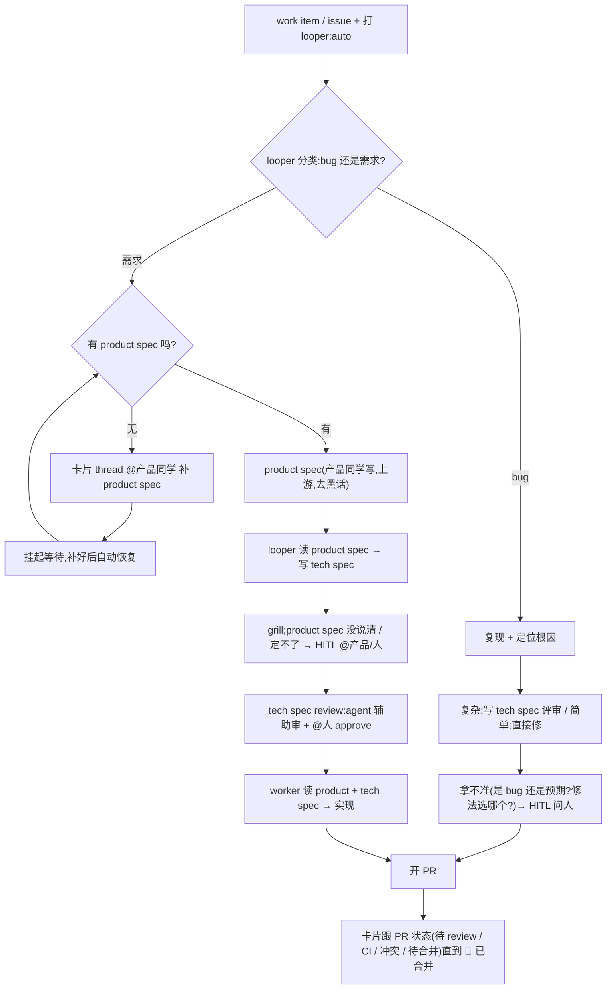

# PLAN — looper 自动化研发流程改造

> 状态:草案 · 待拍板。汇总真机试跑 + 群里试用后暴露的问题,以及定下来的改造方向。给团队 review 用。
> 背景:looper 每人本地跑一套,任务卡片发到同一个飞书群。

**先约定几个词**(下面反复出现):
- **HITL**:human-in-the-loop —— agent 拿不准时,发一张卡片到群里问人。
- **卡片**:looper 为每个任务在飞书群里发的那张卡(标题 + 进度);点开是一个 thread(折叠讨论)。
- **PR / CI / label**:GitHub 的拉取请求 / 持续集成检查 / 标签。
- **looper 的 4 个角色**:分别负责 **写方案、写代码、审 PR、修 PR**。
- **spec-forge**:一个把需求写成方案、再让另一个 agent 逐轮"挑刺拷问"的工具(skill)。

## 1. 为什么要改

HITL 已经上线(v0.10.1)。用一个全新 agent 照文档从零配好、跑了个真任务、把卡片发进群之后,暴露出一批「看着含糊 / 不太对 / 不够稳」的问题。这份文档把它们和对应改法理清,作为分批实现的依据。

一句话目标:**卡片准确反映任务的真实状态;标签只表达「要做什么」、不随进度乱变;笔记本随时关也能自恢复;只有代码真正合并才算完成。**

## 1.5 目标流程图(北极星)

> 这是我们要 looper 最终跑通的**完整流程**。§3 只是把「已经在跑的那一小段」做对;§8 才是把整张图建起来。评审请对照这张图看 plan 有没有漏、有没有和图冲突。



**贯穿全程**:HITL 一直在(任何阶段 agent 定不了 → 发卡问人);只有「已合并」算完成;该由人做的活不打 `looper:auto`。

## 2. 试跑暴露的问题

| # | 现象 | 说明 |
|---|---|---|
| P1 | 同一个任务**发了 2–3 张卡** | 两个动作几乎同时抢跑各发一张;而且「写方案」和「写代码」是两段、又各发一张。缺「同一任务只留一张卡」的约束。 |
| P2 | 「处理中」卡片**露出原始命令行**(像 `tmpdir=$(mktemp …`) | 标题是从工具输出硬猜的;没有里程碑时就退化成显示裸命令。 |
| P3 | 「✅ 已完成」**其实没完成** | 这里的「完成」只是「开了 PR」,PR 还开着没合并;后面还有 review / QA / 解冲突 / CI / 合并一整条。 |
| P4 | 一个需求**冒出 2 个 PR** | 默认「写方案」和「写代码」被同一个标签触发,各开了一个 PR(而且配置也配错了)。 |
| P5 | 任务做完后,**群里再追问它不理人** | 已完成的任务直接忽略后续消息。 |
| P6 | 启动方式是「挂后台跑」 | 一个裸后台进程,**重启 / 合盖 / 退出登录就没了,崩了也不会自己起来**。 |

## 3. 改造项

### A. 卡片 = 任务 / PR 真实状态的实时镜像

**原则**:标题反映**真状态**,不用「处理中 / 已完成」这种含糊说法。**只有「已合并」是绿色终点。**

从 GitHub 读 PR 的真实状态,映射成精准标题:

| PR 实况 | 标题 |
|---|---|
| 草稿 | 📝 草稿 · PR #N |
| CI 跑测中 | 🔄 CI 检查中 · PR #N |
| CI 失败 | ❌ CI 失败 · PR #N |
| 有冲突 | ⚠️ 冲突待解 · PR #N |
| 待 review | 👀 待 review · PR #N |
| 被要求改 | ✋ 待修改 · PR #N |
| 已批准、可合并、CI 绿 | ✅ 待合并 · PR #N |
| **已合并** | 🎉 **已合并** · PR #N ← 唯一终点 |
| 关闭但没合并 | 🚫 已关闭 · PR #N |

**状态从哪来 —— agent 自己报 + GitHub 事件推送,不靠「等需求关闭」(太慢):**
- **在干活时:agent 自己报**。给 agent 一个更新卡片的命令,在提示词里写清期望它报告的状态(开了 PR 待 review / 解冲突中 / 已交付…),它边干边更新。
- **它没在跑的空档**(别人去 review、合并、CI 出结果)→ 靠 **GitHub 事件推送(webhook)实时接**,不去反复查。

### B. 一个任务一张卡(不是「一个 PR 一张」,也不是「一段流程一张」)

**事实**:一个需求可能对应多个 PR(方案一个、实现一个,甚至多个实现)。

- **一个任务 = 一张卡**;写方案、写代码、审、修,以及名下所有 PR,**全汇进这一张**。
- 卡片头是**任务整体进度**;正文逐条列每个 PR 的状态。
- **任务算完成 = 需求真的解决(名下 PR 都合并)**,不是某一个 PR 合了就算。

示例(多 PR):
```
🔧 进行中 · #1 · 2 个 PR
──────────────
· PR #2 方案  👀 待 review
· PR #3 实现  ✅ 待合并
```

### C. 标签只表达「要做什么」,打一次不变

**原则**:**标签在最前面打一次、表达意图**;进度推进是 looper 内部的事,**不靠改标签驱动、也不用人再打第二个**;进度让卡片去体现。

| 标签(全程不变) | 含义 |
|---|---|
| `looper:auto`(新) | 全自动:方案 → 实现,一路到底 |
| `looper:plan` | 只写方案 → 停下,等人评审(轻量,不走 spec-forge 时) |
| `looper:worker-ready` | 直接实现(已有现成方案 / 简单活) |

- **没有「档位」这回事**:实现时 HITL 一直在,agent 卡住就发卡问人 —— 不需要事先把任务分成「全自动 / 要盯着」两档。
- 该由人做的活,**就不打 looper 的标签**,直接给人。
- 顺手修个配置错误:「写代码」应该被 `looper:worker-ready` 触发,之前误配成和「写方案」同一个标签,导致 P4。

### D. 方案文档:产品写 product spec,looper 写 tech spec;评审都在 Plane,不进代码仓

> 团队定调(2026-07-06,陈哲 / 麻薯讨论):方案**长期不放代码仓库**;**评审整套做进 Plane**;方案以 **Plane 文档(Page)** 存在。**product spec(产品方案)由产品同学写(不是 looper);looper 跟进它写 tech spec(技术方案)、评审、实现。**

- **product spec = 产品同学写**(讲清 what / why,给人看、去黑话)。**looper 不写它。**
- **looper 从 product spec 写出 tech spec**:
  - 边写边让另一个 agent 挑刺拷问;**产品方案没说清、agent 自己定不了的点 → 整理成卡片问产品 / 人**(HITL 在写方案阶段就用上了)。
- **技术方案评审(agent 帮着审,不必纯人工)**:一个 agent 先审出漏洞 / 矛盾 / 风险、整理意见;要人拍板的 **@人 approve**;琐碎的可以让 agent 自己过。签字通常还是人,但审的重活交给 agent。
- **实现**:批准后,「写代码」读 产品方案 + 技术方案,直接实现。

**好处**:①分工清楚(**产品写 what,looper 写 how + 做**);②评审在 Plane、不落代码仓、不留悬着的方案 PR;③looper 自带的「写方案」角色、以及「把方案当仓库文件」那套,弃用。

**技术方案怎么读**:方案都是 **Plane 文档**。looper 读它有两种做法(待定):(a) 让 agent 用现成的 `plane` 命令行读(推荐,Plane 文档的一些坑这个工具已踩平);(b) 给 looper 自己加读 Plane 文档的能力。

**为什么两层分开、不把 spec-forge 塞进 looper**:挑刺拷问要靠一个独立的、没被"作者视角"污染的 agent + 真人;两层用 Plane 标签衔接就够。

**待定**:方案批准后,谁把 looper 的标签打上去(人手动 / 发布时预置 / 一个「批准即打标」的小自动化)。

> 简单活(不需要方案)不走这条:直接触发实现。

### E. 恢复能力(笔记本随时关也不丢活)

**已经有的(不用造)**:能装成**开机自启、崩了自动重启的常驻服务**(macOS 走 launchd);每次启动会**自动恢复** —— 把没跑完的活标出来、清掉残留进程、重新排队;而且是**从断点继续**(不从头来),甚至接着原来的 AI 会话跑。

**要改 / 要加固**:
1. **onboarding 改成装常驻服务**(现在是「挂后台」,重启就没)→ 合盖 / 重启后自动起来、自动续。**(P6,最关键的一改)**
2. **睡眠 ≠ 关机**:合盖是把进程挂起(子进程可能死、登录态 / 网络过期);醒来后要能发现并重新驱动 —— 需专门测。
3. **恢复不能重复干**:续跑时不能重复开 PR / 重复发卡 —— 和 P1 的「一个任务一张卡」是同一件事,一起做。
4. **干到一半被杀**:本地改了一半时,重跑那一步要能干净接上 —— 验一下常见情况。

### F. 任务做完后再追问(P5)

PR 没合并前,卡片一直活,追问能接住(转给「修 PR」应答)。**合并之后**再追问,三选一(待定):
- **A** 自动重开 / 续跑(当成新一轮需求或答疑)
- **B** 至少回一句「本任务已完成,继续请在 issue/PR 上说、或新建任务」,别冷场
- **C** 保持不理(现状)

### G. 几个独立的 bug 修复

- **P1 双发**:改成「同一任务只留一张卡」(加约束 + 防抢跑);写方案 / 写代码复用同一张卡。
- **P2 露命令**:标题**永不显示原始命令**;PR 还没开时显示友好措辞(如「🔧 实现中…」),原始工具输出只留在卡片里的讨论中。
- **P3 措辞**:被 A 的状态映射吸收(不再有含糊的「已完成」)。

## 4. 和 synclo AFK 的关系

`looper:auto` = **looper 自己的「全自主执行」入口**。有了它,synclo 那套 `afk:go` 自建执行器就能**退役**:AFK 只保留前面的「分诊 / 拆解 / 派活」,产出改成打 `looper:auto` + 指派,**执行整个交给 looper**。中间那座「把 Plane 任务转成 GitHub issue」的桥,也随 looper 能直接读 Plane 而退役。**注意:同一个任务别既打 `afk:go` 又打 `looper:auto`,否则两个执行器会抢着做。**

## 5. 分批实现(建议)

1. **PR-1 启动 / 恢复健壮性**(低风险,先上):改成装常驻服务;关掉多余的「写方案」角色(或改用全自动档);修好触发标签的配置。
2. **PR-2 一个任务一张卡 + 去掉露命令**(P1 / P2)。
3. **PR-3 卡片 = PR 状态镜像**(A):agent 自报命令 + 提示词状态词表 + 接 GitHub 事件推送 + 状态映射。
4. **PR-4 `looper:auto` 全自动档**(C / D):新标签 + 写方案完成后内部交给写代码 + 方案存 Plane。
5. **PR-5 恢复加固**(E 的 2 / 3 / 4):睡眠唤醒、不重复干、半截续跑。
6. **PR-6 完成后追问**(F,取决于 A / B / C)。

## 6. 待拍板的决策

- [ ] **全自动档标签名**:`looper:auto` / `looper:ship` / `looper:build`?(`looper:go` 别用,撞 `afk:go`)
- [ ] **默认怎么配**:只留「写代码」(关「写方案」)/ 全自动 / 保留「先评审方案」?
- [x] **方案存 Plane 文档(产品 + 技术两份),评审在 Plane,不进代码仓** ✅(已定)
- [x] **不分档位;HITL 一直在、卡住就问;标签只在最前打一次** ✅
- [x] **product spec 产品同学写;looper 只写 tech spec + 评审 + 实现** ✅(已定)
- [ ] **简单活是否跳过技术方案**(直接触发实现)?
- [ ] **技术方案评审**:agent 帮审 + @人 approve,琐碎的允许 agent 自己过 —— 确认?
- [ ] **looper 读 Plane 文档的方式**:(a) 用 `plane` 命令行(推荐)/ (b) 给 looper 加能力?
- [ ] **全自动档触发范围**:一个标从「写方案」一路到「实现」(需要一个调度器把 spec-forge 和 looper 串起来),还是「方案批准后」才进 looper?
- [ ] **「任务完成」怎么算**:源需求关闭 / 名下 PR 全合并 / 两者兼顾?
- [ ] **完成后追问**:A / B / C?
- [ ] **状态刷新**:以 GitHub 事件推送为主 + 兜底轮询(如 60 秒)?
- [ ] **给一个单独测试群**(不碰生产群「Looper 协作」)供真机验证?

## 7. 怎么验证、别踩雷

- **绝不**再用生产群「Looper 协作」做测试(研发已入群)。飞书上的真机验证只在**单独的测试群**。
- 每个 PR:单元测试 + 本地一键校验 + 在测试群 / 临时仓过一遍真机。
- 安全尾巴:把泄露过的 Plane key 轮换掉(每人用自己的一把)。

## 8. 通往流程图:还要建的能力(逐个详设)

> **重要**:前面 §3(A–G)是「把现在**已经在跑**的 HITL 卡片做对」—— 一个小 PR 就能收。
> 这一章是「要让**整张流程图**真跑起来,还得**新建**的能力」—— **大头在这里,多数是全新的**。两者是两个 tier,别混。

### 8.0 总体:加一个「入口分流」(intake gate)
work item 进 looper(打 `looper:auto`)后,先过一个分流 gate,再决定走哪条:
```
work item
 → intake gate:
    ① 分类 bug / 需求            (LLM,见 8.1)
    ② 需求 → 查有没有产品方案      (见 8.2)
        ├ 没有 → @产品补 + 挂起    (见 8.3)
        └ 有   → 进方案流水线       (见 8.4–8.6)
    ③ bug → 进 bug 流             (见 8.7)
```
它可以是 looper coordinator 角色的扩展(coordinator 已会做 LLM 分诊),或一个新的轻量「intake」步骤。

### 8.1 分流①:bug / 需求 分类器(全新,要 LLM 提示词)
- **输入**:work item 的标题、正文、标签、类型(Plane 的 bug vs story 是强信号)、关联页面。
- **输出**:`bug | 需求` + 依据 + 置信度。
- **提示词要点**:「描述的是『已有行为坏了』(bug)还是『要新增能力』(需求)?」Plane 工作项类型优先。
- **不确定 → HITL**:发卡问人「这个算 bug 还是需求?」。

### 8.2 分流②:产品方案存在性检查(全新)
- 需求要有一份 **product spec(Plane 文档)**。检查 work item 有没有链接这样一份页面。
- **机械部分**:读 work item 的关联页面(`plane api`),按约定(命名 / 标签 / 链接字段)识别「产品方案」页。
- **可选 LLM 质量门**:「这份页面够不够格当产品方案(讲清了 what / why / 验收没)?」不够 → 当『缺』处理。

### 8.3 缺产品方案 → @产品同学补(全新机制 + 全新配置)
三样都要建:
- **配置「产品是谁」**:每个项目配一个**产品负责人**(飞书 open_id;如需在 Plane 操作还要 Plane id)。新配置项(如 `projects[].productOwner`)。
- **@ + 提示**:在任务卡片的 thread 里发一条 @产品负责人:「这个需求还没产品方案,请补一份并链到 <work item>」。
- **挂起 + 恢复**:任务进入一个**新的等待态**「等产品方案」(和现在 HITL「等决策卡回复」不同)。**恢复触发** = 检测到该 work item 关联了产品方案页(定期查 / Plane 事件,如果 Plane 有 webhook)→ 自动恢复,进 8.4。
- ⚠️ 这是一种新的「**等外部产物**」的等待,不是「等人回一句」。

### 8.4 读产品方案 · 写技术方案(全新)
- **读**:把产品方案(Plane 文档)作为上下文读进来(`plane api page get --content`,或给 looper 加读页能力)。
- **写 tech spec**:looper 据产品方案写出**技术方案**,**建成一份 Plane 文档**(`plane api page create`),链到 work item + 置 `spec:reviewing`。—— 取代现在「方案是仓库里的 md 文件」那套。

### 8.5 grill 技术方案 + 定不了的问人(全新,spec-forge 集成)
- 让一个**独立 agent 逐轮拷问**这份技术方案(找漏洞 / 矛盾 / 风险)。
- **分流③(隐性)**:拷问中「**这点我自己定不了、要人拍板**」→ 整理成 **HITL 卡问产品 / 人**。也是 LLM 提示词驱动的判断。
- 复用 spec-forge(松耦合:spec-forge 跑、产出 Plane 页,looper 在批准后接手)。

### 8.6 技术方案评审(全新,在 Plane 上)
- **review agent** 先审技术方案页(漏洞 / 矛盾 / 风险)→ 在 Plane 上留意见。
- **@人 approve**:要人拍板的 @产品 / 技术负责人;琐碎的可配置 agent 自过。
- ⚠️ 现在只有 **GitHub PR** 的 spec 评审;**Plane 文档页的评审要新建**。

### 8.7 bug 流:复现 + 定位 + 修(部分新)
- bug 不需要产品方案。worker / fixer 加一个「**先复现、再定位根因、再修**」的模式(新提示词),而不是「照方案实现」。
- 拿不准(是 bug 还是预期?两种修法选哪个?)→ HITL 问人。

### 8.8 新增配置清单
| 配什么 | 谁配 | 备注 |
|---|---|---|
| 产品负责人(飞书 open_id / Plane id) | 每项目 | 缺方案时 @谁 |
| 标签词表 | 全局 | `looper:auto` / `spec:reviewing` / … |
| Plane 项目 + key | 每人 | 已有 |
| 测试群 / 生产群 | 全局 | 已有 |

### 8.9 分流点汇总(哪些要提示词)
| 分流 | 判断 | 要 LLM 提示词? |
|---|---|---|
| ① bug / 需求 | 缺陷还是新增 | ✅ 要 |
| ② 有没有产品方案 | 主要机械 + 可选质量门 | ⚠️ 机械为主,质量门可加 |
| ③ grill「能不能自己定」 | 自己定 or 问人 | ✅ 要(拷问的核心) |
| ④ 评审 approve | agent 审 + 人拍板 | ⚠️ 审用 LLM,拍板归人 |

### 8.10 分期(先小后大)
- **P0(现在)**:§3 卡片修复 + onboarding。让已跑的部分体面。
- **P1**:入口分流(8.0)+ bug / 需求分类(8.1)+ bug 模式(8.7)。让 looper 能分流两类。
- **P2**:Plane 方案读写(8.4)+ spec-forge 技术方案(8.5)+ Plane 评审(8.6)。方案流水线。
- **P3**:缺产品方案的 @产品 + 等待 / 恢复 + 产品负责人配置(8.3)。人的拉入。
- **P4**:`looper:auto` 全自动串联(§C / §D)。

---
🤖 与 Claude Code 协作整理
